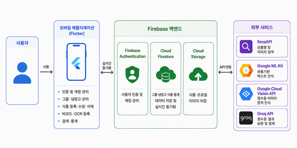
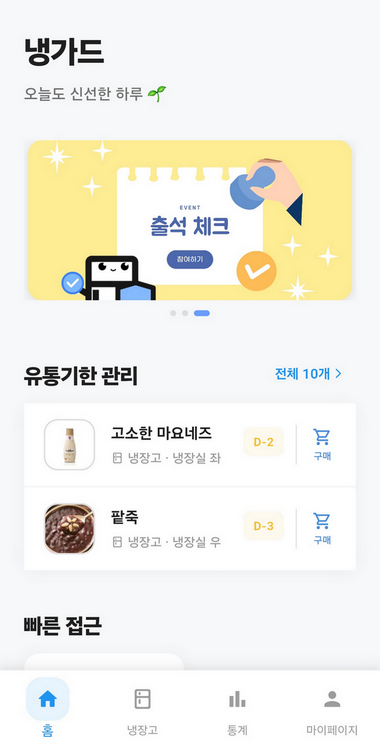
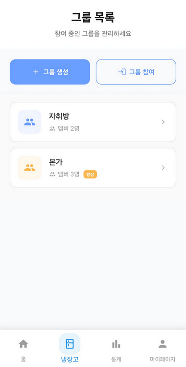
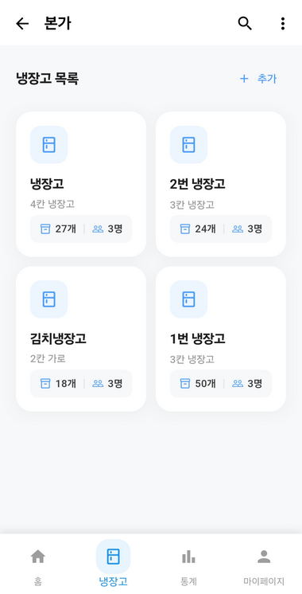
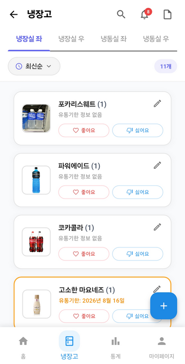
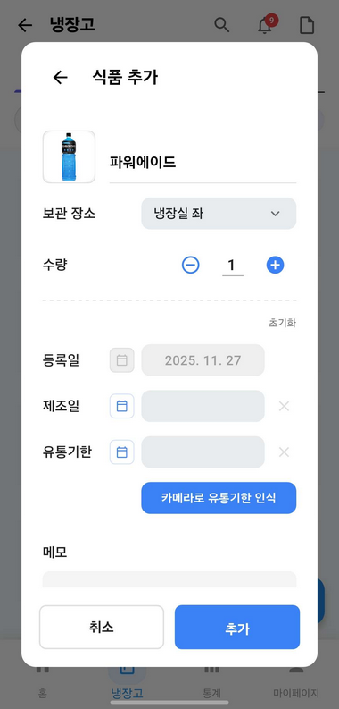
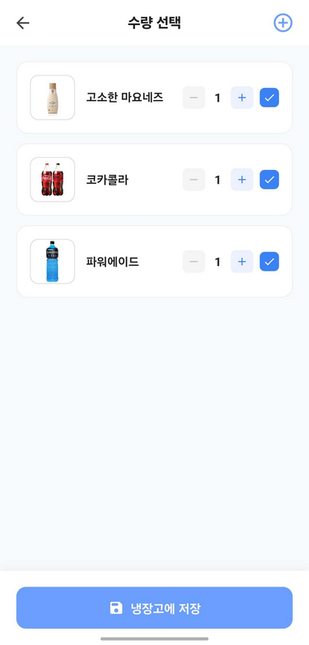
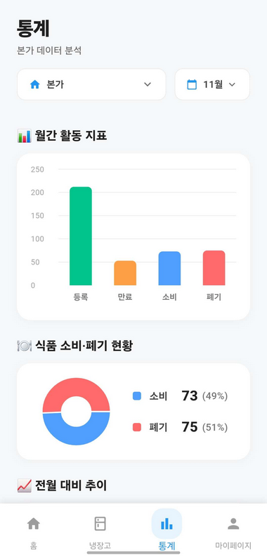
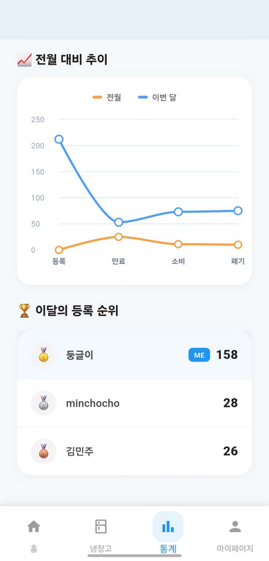

# 효율적인 냉장고 식품 관리 애플리케이션

> 바코드·OCR 기반 식품 등록과 실시간 정보 공유를 통해 냉장고 식품의 구매·보관·소비·폐기 과정을 관리하는 모바일 애플리케이션

## 프로젝트 개요

| 구분 | 내용 |
| --- | --- |
| 프로젝트 유형 | 컴퓨터공학과 팀 졸업작품 |
| 개발 기간 | 2025.03 ~ 2025.11 |
| 참여 인원 | 3명 |
| 주요 기여 | 바코드 기반 식품 등록 및 일괄 등록 기능 개발, 월별·누적 식품 통계와 식품 잠금·권한 기능 구현 |
| 개발 환경 | Dart, Flutter, Android Studio |
| 백엔드 | Firebase Authentication, Firestore Database, Cloud Storage |
| 수상 | ICT융합대학 학장상 대상 |

## 프로젝트 소개

냉장고 안의 식품은 보관 위치와 구매·개봉·소비 시점이 서로 달라 현재 수량과 유통기한을 기억에 의존하기 어렵습니다. 여러 사람이 하나의 냉장고를 사용하는 환경에서는 구성원 간 정보 공유 부족으로 중복 구매, 식품 방치, 유통기한 경과와 같은 문제가 더욱 자주 발생합니다.

이 프로젝트는 개인·다인 가구와 공동생활 공간에서 냉장고 식품을 함께 관리할 수 있도록 개발한 모바일 애플리케이션입니다. 사용자는 그룹과 냉장고를 생성하고 식품의 위치·수량·유통기한을 기록할 수 있으며, 변경된 정보는 Firebase를 통해 구성원에게 실시간으로 반영됩니다.

바코드 스캔, 타임 바코드, 영수증 OCR을 활용해 반복 입력을 줄이고, 유통기한 관리와 소비·폐기 통계를 통해 식품 낭비를 줄이는 것을 목표로 했습니다.

## 주요 기능

### 1. 사용자 인증 및 그룹·냉장고 공동 관리

- 이메일·Google·비회원 로그인 및 계정 전환
- 그룹 생성, 초대 코드를 이용한 참여 및 멤버 관리
- 개인·공유 냉장고 생성 및 칸 구성
- 식품 정보 실시간 동기화

### 2. 다양한 식품 등록 방식

- 식품 정보 직접 입력 및 유통기한 OCR
- 바코드 기반 상품명·이미지 조회 및 식품 등록
- 여러 제품을 연속 스캔하는 일괄 등록 및 중복 수량 누적
- 타임 바코드 및 영수증 OCR 기반 식품 정보 인식

### 3. 유통기한 및 식품 상태 관리

- 유통기한 임박·만료 식품 확인 및 D-Day 표시
- 식품 소비·폐기 처리 및 상태 실시간 반영
- 식품명 기반 온라인 상품 검색 및 구매 여부 기록
- 제조일자·유통기한·메모·이미지 등 식품 정보 관리

### 4. 검색·선호도 및 공유 식품 관리

- 그룹 및 냉장고 단위 식품 검색과 결과 위치 이동
- 식품명·메모·한글 초성 기반 검색
- 식품별 좋아요·싫어요 설정
- 식품 잠금·해제 및 사용자별 관리 권한 제어

### 5. 소비·폐기 통계

- 월별·누적 식품 등록·소비·폐기 현황
- 유통기한 전·후 소비·폐기 현황 구분
- 전월 대비 통계 비교
- 사용자별 식품 등록 순위 및 통계 시각화

## 주요 기여 내용

### 바코드 스캔 및 유통기한 OCR 등록 흐름 통합

기존에 별도로 작업되어 있던 바코드 스캔과 유통기한 OCR 기능을 졸업작품의 식품 등록 흐름에 맞게 연결하고 정리했습니다. 모바일 카메라로 인식한 바코드 정보를 식품 등록 화면에서 활용할 수 있도록 연결했고, 유통기한 입력 필드에서는 Google ML Kit 기반 OCR 결과를 등록 과정에서 사용할 수 있도록 화면 흐름을 맞췄습니다.

통합 과정에서 상품 정보가 누락되거나 인식에 실패하는 경우에도 사용자가 등록을 이어갈 수 있도록 기본값과 예외 처리를 보완했습니다. 또한 카메라 권한, Android SDK, multidex, ProGuard 설정을 수정해 OCR 및 카메라 사용 중 발생하던 앱 실행 오류를 해결했습니다.

### 영수증 인식 및 일괄 등록 UI 개선

여러 식품을 한 번에 등록할 수 있도록 영수증 인식 기능과 일괄 등록 화면을 정리했습니다. 영수증에서 추출한 항목을 등록 후보로 보여주고, 바코드/영수증/직접 입력 방식이 같은 식품 추가 흐름으로 이어지도록 다이얼로그와 화면 구성을 개선했습니다.

반복 등록 과정에서 사용자가 확인해야 하는 정보를 줄이고, 등록 방식별 화면이 따로 놀지 않도록 UI를 통일하는 데 집중했습니다.

### 홈 화면과 유통기한 관리 화면 구성

앱 실행 후 냉장고 상태를 빠르게 파악할 수 있도록 홈 화면을 추가했습니다. 홈에서는 냉장고 목록, 유통기한 임박/만료 식품, 빠른 접근 메뉴를 배치했고, 별도의 유통기한 임박/만료 화면을 통해 관리가 필요한 식품을 모아서 확인할 수 있도록 구성했습니다.

화면 간격, 배너, 하단 네비게이션, 통계 카드 우선순위를 조정해 사용자가 자주 보는 정보를 더 쉽게 찾을 수 있게 개선했습니다.

### 식품 이미지 편집 및 업로드 기능 구현

식품 등록 과정에서 이미지를 더 자연스럽게 관리할 수 있도록 이미지 편집 및 업로드 기능을 추가했습니다. 이미지 크롭 화면, 이미지 편집 서비스, 이미지 업로드 서비스를 구현하고, 식품 카드와 상세 화면에서 이미지가 일관되게 표시되도록 UI를 보완했습니다.

### 냉장고 내부 식품 목록 및 식품 추가/수정 UI 개선

냉장고 칸 내부의 식품 목록 화면과 식품 카드를 개선했습니다. 식품 추가/수정 다이얼로그, 날짜 선택 UI, 탭 전환 후 소비/폐기 처리, 정렬 기능, 로딩 속도 등을 보완해 실제 사용 흐름에서 어색한 부분을 줄였습니다.

특히 탭 전환 후 소비/폐기 동작이 정상 처리되지 않는 문제와 냉장고 화면 로딩 체감을 개선해 관리 화면의 안정성을 높였습니다.

### 마이페이지와 선호도 통계 화면 개선

마이페이지의 프로필, 아바타, 알림 설정, 선호도 화면을 정리하고, 사용자가 좋아요/싫어요 데이터를 확인할 수 있도록 선호도 통계 화면을 보완했습니다. 앱 정보, 개인정보 처리방침, 이용약관 화면을 추가해 설정 메뉴의 완성도도 높였습니다.

## 시스템 구조



- Firebase Authentication: 이메일·Google·비회원 인증 및 계정 관리
- Cloud Firestore: 그룹·냉장고·식품·통계 데이터 저장 및 실시간 동기화
- Cloud Storage: 식품·프로필 이미지 저장
- SerpAPI: 바코드 기반 상품명·이미지 검색
- Google ML Kit: 유통기한 텍스트 인식
- Google Cloud Vision API: 영수증 이미지 문자 인식
- Groq API: 영수증 인식 결과 보완 및 정제

## 기술 스택

| 구분 | 기술 | 활용 내용 |
| --- | --- | --- |
| Language | Dart | 애플리케이션 UI 및 기능 로직 구현 |
| Framework | Flutter | Android 기반 모바일 애플리케이션 개발 |
| Backend | Firebase Authentication | 이메일, Google, 비회원 로그인 및 계정 전환 |
| Database | Cloud Firestore | 그룹·냉장고·식품·통계 데이터 저장 및 실시간 동기화 |
| Storage | Cloud Storage | 식품·프로필 이미지 저장 |
| Barcode | mobile_scanner | 제품 바코드 및 타임 바코드 인식 |
| Product Search | SerpAPI | 바코드 번호 기반 상품명·이미지 조회 |
| OCR | google_ml_kit | 유통기한 텍스트 인식 |
| OCR | Google Cloud Vision API | 영수증 문자 인식 |
| AI API | Groq API | 영수증 인식 결과 정제 |
| Tool | Android Studio | 개발 및 디버깅 |
| Test | Android Emulator, Android 실제 기기 | 기능 및 화면 동작 확인 |

## 주요 화면

| 홈 | 그룹 관리 |
| --- | --- |
|  |  |

| 냉장고 목록 | 식품 목록 |
| --- | --- |
|  |  |

| 식품 등록 | 일괄 등록 |
| --- | --- |
|  |  |

| 월별 통계 | 비교·사용자 통계 |
| --- | --- |
|  |  |

## 실행 방법

```bash
git clone https://github.com/Haluey/refrigerator-food-management-app.git
cd refrigerator-food-management-app
flutter pub get
flutter run
```

Firebase 설정, 외부 API Key 구성 및 빌드 방법은 아래 문서를 참고해주세요.

[SETUP_AND_BUILD.md](./SETUP_AND_BUILD.md)

## 프로젝트 성과

- ICT융합대학 학장상 대상 수상
- 3인 팀의 팀장으로 프로젝트 진행
- 바코드·OCR·실시간 동기화를 활용한 공유 냉장고 식품 관리 구현
- 소비·폐기 통계와 식품 잠금·권한 기능을 통한 관리 기능 확장

## 시연

- 시연 영상: [URL 입력 필요]